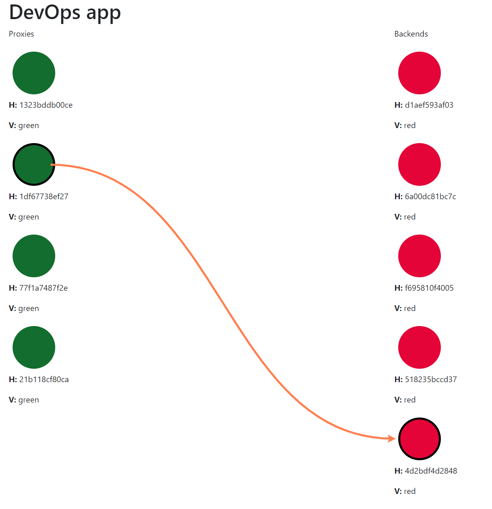

# Devops example application

This application serves as an example to show different methodologies for deployment and building in DevOps. 

It consists of four services:
- frontend
- proxy
- backend
- redis

## App diagram with request flow
```
  +--------------+                                      +--------------+
  |              |                                      |              |
  |   Frontend   |                                      |    Redis     |
  |              |                                      |              |
  +----------+---+                                      +----------+---+
       ^     |                                               ^     |
       |     |                                               |     |
       1     2                                               5     6
       |     |                                               |     |
       |     v                                               |     v
  +----+---------+             +-------------+          +----+---------+
  |              +------3----->|             +----4---->|              |
  |    Client    |             |    Proxy    |          |    Backend   |
  |              |<-----8------+             |<---7-----+              |
  +--------------+             +-------------+          +--------------+
```

## App UI

The application displays proxy and backend instances with version and hostname. Also displays which instances handled the current connection by connecting them by an arrow.



## How to run the application

To start the application `cd` into the **.deployment** folder and either run `dip provision` or `docker-compose up -d`. 

In case of docker compose the command will need to be run multiple times because of dependencies, dip tool handles it automatically.

## Folder and file structure

#### Application folders

Whole application is kept in **frontend**, **backend** and **proxy** folders. Each consists of service code, makefile for building and running the application, Dockerfile and files used to deploy to Google Cloud environment.

#### Other folders

- **.build** - builds all components using dip. Used by CI.
- **.deployment** - deploys whole project using dip. Can be deployed locally or on external server
- **.github** - stores workflows for Github Actions
- **ansible** - configures Jenkins server and staging and production environments with auto deployment. To be used with **terraform** folder
- **doc** - documentation related files
- **jenkins** - container related files to deploy Jenkins locally
- **terraform** - code for deploying infrastructure using [Hetzner Cloud](https://www.hetzner.com/) and [Cloudflare](https://www.cloudflare.com/)
- **test** - files for testing infrastructure

#### Files

- **Jenkinsfile** - different Jenkinsfiles used by Jenkins
- **.travis.yml** - Travis CI pipeline

## Author

[Jan Kacik](https://github.com/Consek)
